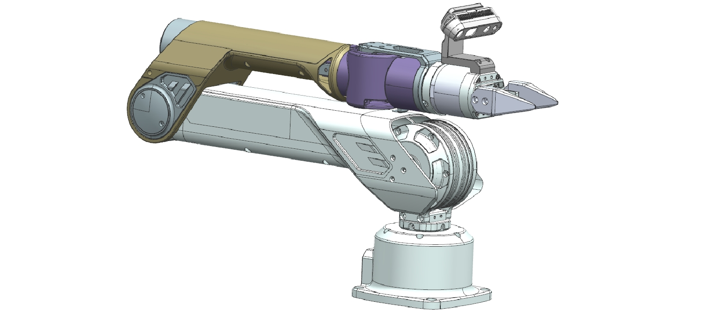

# Tabletop Teleoperation SDK Guide

## Software Dependency

1. Ubuntu 20.04 LTS
2. ROS Noetic

## Installation

The SDK does not require recompilation. Please refer to the contents below.

## Operation and Control

<u>Important: Before you power on the arms, please set arms at the position and pose shown on the following image.</u>



1. For the first use, after confirming the power supply and USB connection, run the following command to modify the read and write permissions of the serial port files:

    ```shell
    sudo chmod 777 /dev/tabletop_tele_arm_port_*
    ```

2. After confirming the modification, you can initialize the SDK:

    ```shell
    cd a1_driver_sdk/install
    source setup.bash
    roslaunch signal_arm tabletop_tele_arm_node_left.launch
    ```

       ```shell
   cd a1_driver_sdk/install
   source setup.bash
   roslaunch signal_arm tabletop_tele_arm_node_right.launch
   ```

       ```shell
   cd a1_driver_sdk/install
   source setup.bash
   roslaunch mobiman tabletop_tele_mobiman_l.launch
   ```

       ```shell
   cd a1_driver_sdk/install
   source setup.bash
   roslaunch mobiman tabletop_tele_mobiman_r.launch
   ```

## Driver Interface

The interface is a ROS package designed for manipulator control and status feedback. This package defines several topics for publishing and subscribing to the robot arm’s status, control commands, and associated error codes. Below are detailed descriptions of each topic and its related message types:

   <table style="width: 100%;border-collapse: collapse;">
       <thead>
           <tr style="background-color: black; color: white;text-align: left;">
               <th>Topic Name </th>
               <th>Description </th>
   	    <th>Message Type</th>
           </tr>
       </thead>
       <tbody>
           <tr style="background-color: white;text-align: left;">
               <td>/joint_states_host_left<br> /joint_states_host_right<br> /joint_states_slave_right<br> /joint_states_slave_right</td>
               <td>Robot arm joint status feedback</td>
   			<td>sensor_msgs/JointState</td>
           </tr>
           <tr style="background-color: white;text-align: left;">
               <td>/arm_status_host_left<br>/arm_status_host_right<br>/arm_status_slave_left<br>/arm_status_slave_right</td>
               <td>Robot arm motor status feedback</td>
   			<td>signal_arm/status_stamped</td>
           </tr>
           <tr style="background-color: white;text-align: left;">
               <td>/arm_joint_command_host_left<br>/arm_joint_command_host_right<br>/arm_joint_command_slave_left<br>/arm_joint_command_slave_right</td>
               <td>Robot arm joint control interface</td>
   			<td>signal_arm/arm_control</td>
           </tr>
       </tbody>
   </table>


<table style="width: 100%; border-collapse: collapse;">
    <thead>
        <tr style="background-color: black; color: white; text-align: left;">
            <th style="width: 200px; vertical-align: middle; padding: 8px; border: 1px solid #ddd;">Topic Name</th>
            <th style="width: 300px; vertical-align: middle; padding: 8px; border: 1px solid #ddd;">Field</th>
            <th style="width: 300px; vertical-align: middle; padding: 8px; border: 1px solid #ddd;">Description</th>
        </tr>
    </thead>
    <tbody>
        <tr style="background-color: white;">
            <td style="vertical-align: middle; padding: 8px; border: 1px solid #ddd;" rowspan="4">/joint_states_host_left<br> /joint_states_host_right<br> /joint_states_slave_right<br> /joint_states_slave_right</td>
            <td style="vertical-align: middle; padding: 8px; border: 1px solid #ddd;">Header</td>
            <td style="vertical-align: middle; padding: 8px; border: 1px solid #ddd;">Standard header</td>
        </tr>
        <tr style="background-color: white;">
            <td style="vertical-align: middle; padding: 8px; border: 1px solid #ddd;">name</td>
            <td style="vertical-align: middle; padding: 8px; border: 1px solid #ddd;">Name of each arm joint</td>
        </tr>
        <tr style="background-color: white;">
            <td style="vertical-align: middle; padding: 8px; border: 1px solid #ddd;">position</td>
            <td style="vertical-align: middle; padding: 8px; border: 1px solid #ddd;">Position of each arm joint</td>
        </tr>
        <tr style="background-color: white;">
            <td style="vertical-align: middle; padding: 8px; border: 1px solid #ddd;">velocity</td>
            <td style="vertical-align: middle; padding: 8px; border: 1px solid #ddd;">Velocity of each arm joint</td>
        </tr>
        <tr style="background-color: white;">
            <td style="vertical-align: middle; padding: 8px; border: 1px solid #ddd;" rowspan="3">/arm_status_host_left<br>/arm_status_host_right<br>/arm_status_slave_left<br>/arm_status_slave_right</td>
            <td style="vertical-align: middle; padding: 8px; border: 1px solid #ddd;">header</td>
            <td style="vertical-align: middle; padding: 8px; border: 1px solid #ddd;">Standard header</td>
        </tr>
        <tr style="background-color: white;">
            <td style="vertical-align: middle; padding: 8px; border: 1px solid #ddd;">status.name</td>
            <td style="vertical-align: middle; padding: 8px; border: 1px solid #ddd;">Name of each status</td>
        </tr>
        <tr style="background-color: white;">
            <td style="vertical-align: middle; padding: 8px; border: 1px solid #ddd;">status.motor_errors</td>
            <td style="vertical-align: middle; padding: 8px; border: 1px solid #ddd;">Errors of each status</td>
        </tr>
        <tr style="background-color: white;">
            <td style="vertical-align: middle; padding: 8px; border: 1px solid #ddd;" rowspan="7">/arm_joint_command_host_left<br>/arm_joint_command_host_right<br>/arm_joint_command_slave_left<br>/arm_joint_command_slave_right</td>
            <td style="vertical-align: middle; padding: 8px; border: 1px solid #ddd;">header</td>
            <td style="vertical-align: middle; padding: 8px; border: 1px solid #ddd;">Standard header</td>
        </tr>
        <tr style="background-color: white;">
            <td style="vertical-align: middle; padding: 8px; border: 1px solid #ddd;">p_des</td>
            <td style="vertical-align: middle; padding: 8px; border: 1px solid #ddd;">Position command of robot arm</td>
        </tr>
        <tr style="background-color: white;">
            <td style="vertical-align: middle; padding: 8px; border: 1px solid #ddd;">v_des</td>
            <td style="vertical-align: middle; padding: 8px; border: 1px solid #ddd;">Velocity command of robot arm</td>
        </tr>
        <tr style="background-color: white;">
            <td style="vertical-align: middle; padding: 8px; border: 1px solid #ddd;">t_ff</td>
            <td style="vertical-align: middle; padding: 8px; border: 1px solid #ddd;">Torque command of robot arm</td>
        </tr>
        <tr style="background-color: white;">
            <td style="vertical-align: middle; padding: 8px; border: 1px solid #ddd;">kp</td>
            <td style="vertical-align: middle; padding: 8px; border: 1px solid #ddd;">Proportion coefficient of position</td>
        </tr>
        <tr style="background-color: white;">
            <td style="vertical-align: middle; padding: 8px; border: 1px solid #ddd;">kd</td>
            <td style="vertical-align: middle; padding: 8px; border: 1px solid #ddd;">Differential coefficient of position</td>
        </tr>
        <tr style="background-color: white;">
            <td style="vertical-align: middle; padding: 8px; border: 1px solid #ddd;">mode</td>
            <td style="vertical-align: middle; padding: 8px; border: 1px solid #ddd;">Control mode</td>
        </tr>
    </tbody>
</table>


